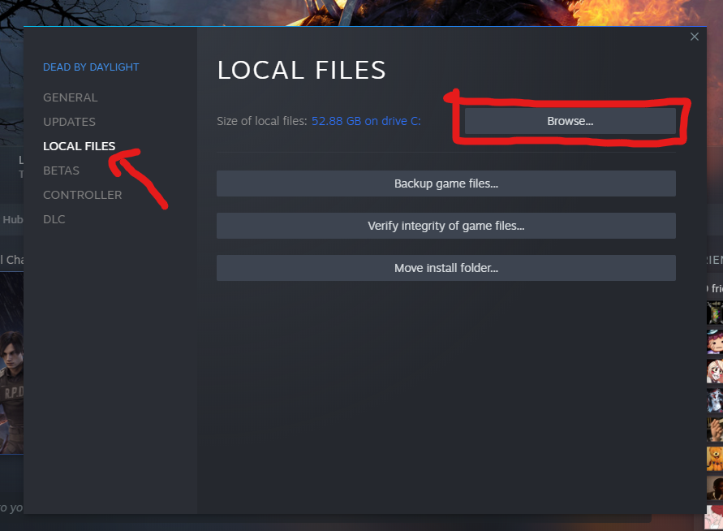
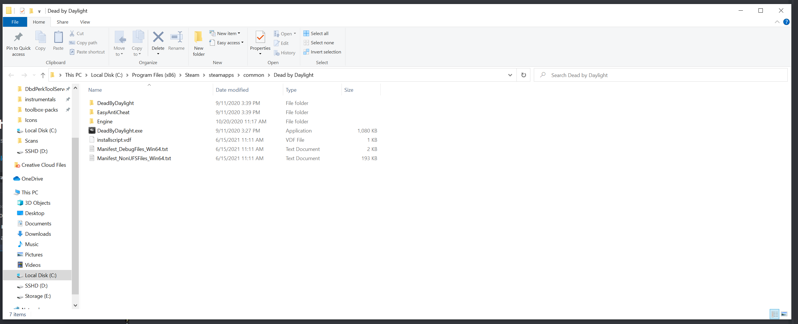
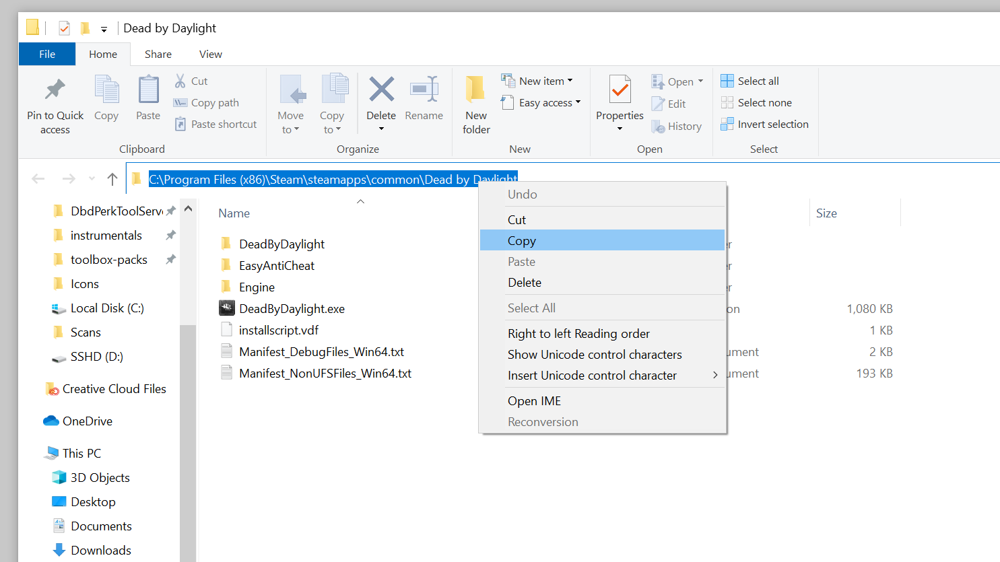
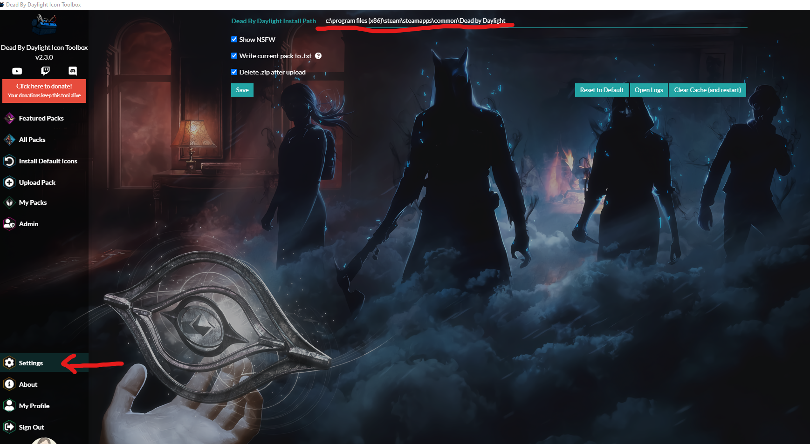

## I am getting an error asking me to set my install location via the Setting tab. What do I do?
The tool needs to know where DBD is installed so that it can copy your custom icons to the correct place! This is usually auto-detected, but may not work properly depending on your specific machine setup. Here's how to set it manually:

### 1. Open Steam, right click on DBD in your Library, and go to Properties

### 2. Click on LOCAL FILES on the left navigation area, and then click on Browse

### 3. Click on the path in Windows Explorer and copy the location

### 4. In the Icon Toolbox, click on Settings in the left navigation area

### 5. Paste the location into the field for Dead By Daylight Install Path

### 6. Click Save!

## What happened to the NSFW Icon Packs?
They're gone, such is life. You can get that kind of content elsewhere.

## How can I remove a pack?
"Installing" an icon pack is really just copying image files into the DBD directory, so it's always an "overwrite" type operation. There are two ways to remove a pack:

1. Install a new pack _over_ your current pack
2. Delete the DBD UI/Icons directory

## How can I install the default icons again? I don't want custom icons anymore!
You can either click on Install Default Icons in the Toolbox and install that pack, or delete the DBD UI/Icons directory.

## Is this safe?
Over 20 THOUSAND people use this tool (which is insane) and nobody has ever been banned for using custom icons. EAC simply does not care about the icons files. With that being said, there is always a small risk that they will decide to care in the future. In that case, you'll likely be warned. 

It's also worth noting that on occasion when there's a DBD Update, EAC will give you a warning about your game files. This isn't related to the toolbox, it's been happening for years!