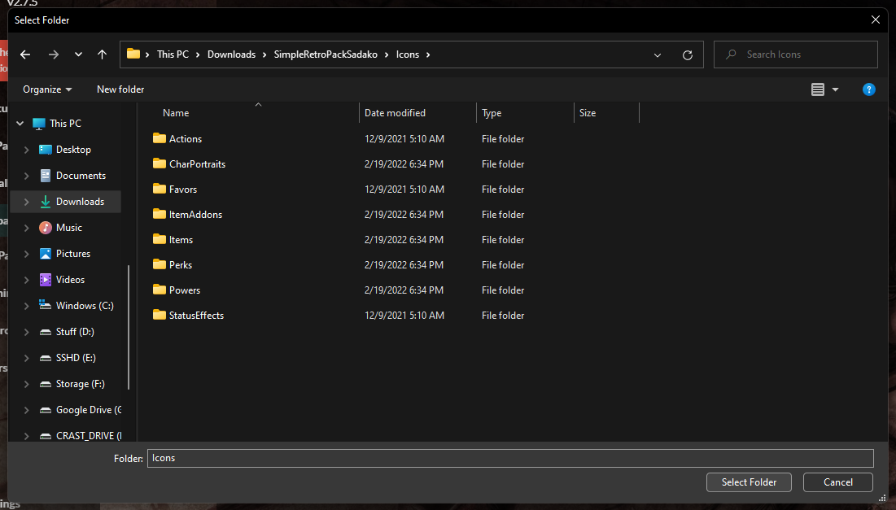
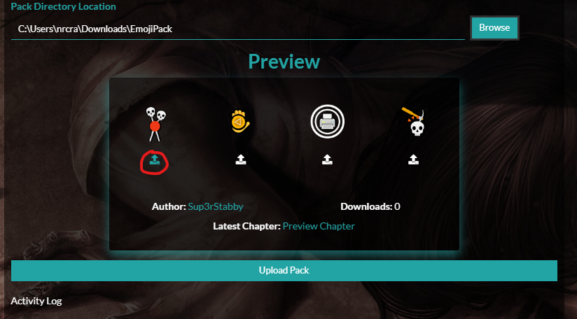
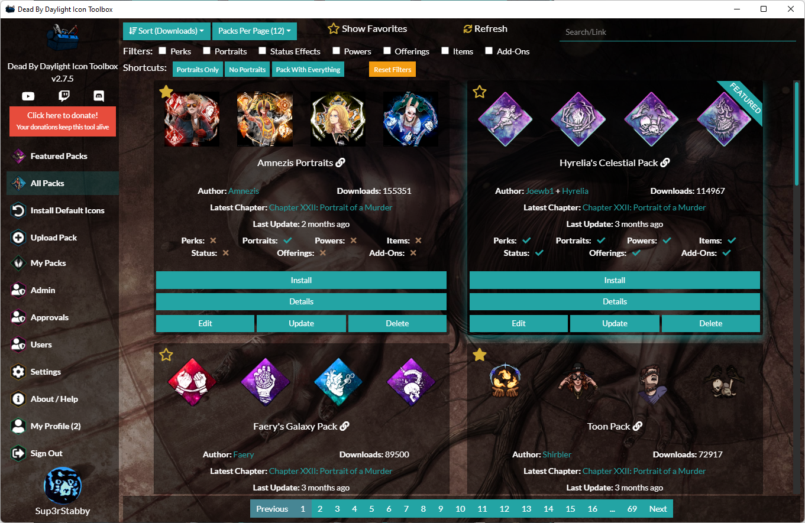

The Dead By Daylight Icon Toolbox is a desktop Windows application designed to make the process of browsing for & installing Perks (and Icons/Char Portraits) easy. The tool will autodetect your Dead By Daylight installation location in most cases. All you need to do is click "install", and the tool will install the perk pack directly to your Dead By Daylight directory. You can then just fire up the game and enjoy!

If you've installed Dead By Daylight from the Windows Store, you will be unable to use this tool. Windows store seems to install applications as _read only_, so there's no way to use custom perks.

## Pack Submission
### Self Service
As of version 2, you are now able to upload your pack yourself if you log into the tool via Steam! 

Simply log in and:
* Navigate to the "Upload Pack" area
* Fill out a title 
* [Optionally] Fill out a description
* Browse for your pack location. In the windows browse dialog, go _inside_ the folder containing your pack images, and then click "Select Folder". It should look something like this:

Then click upload pack.

#### Customization
You can customize the preview icons that are shown for your pack by clicking on the icon below each preview image.

You can either select 4 individual images OR one large banner. If you want to use a single banner image for your pack preview, create a 1200 x 300 rectangular image and select that in any one of your perk preview slots. The tool will automatically detect that you've selected a banner. 

### Alternate Approach
In order to submit a icon pack, please contact me either on [Discord](https://discordapp.com/invite/3WexstV) or [Reddit](https://reddit.com/message/compose?to=elpantalla&subject=My+Icon+Pack) and send me the .zip. 

## Issues
You can report any isses to me on Discord or through the [issue tracker](https://github.com/nrcrast/DbdPerkTool/issues) on GitHub. 

## Screenshots

## Limitations/Future Dev
See [GitHub Issues](https://github.com/nrcrast/DbdPerkTool/issues) to track future development.
Feel free to fork and hit me with a PR!

## Icon Credits
Credit for Application Icons and the icon at the top of this page goes to [HappyClown](https://steamcommunity.com/groups/HappyClownsColoredIcons) + [Yoinks](https://steamcommunity.com/profiles/76561198148794186/). Please don't hesistate to reach out if my use of your beautiful icons is an issue!
