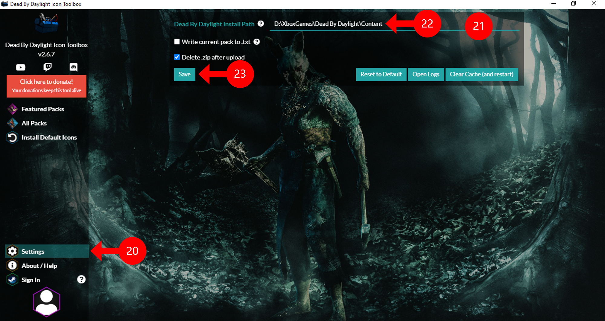

### Here's a way to install custom icon on Dead by Daylight in Xbox Game pass for PC

## Prerequisite
 - Microsoft Store (with Game pass account)
 - [Xbox](https://www.microsoft.com/store/productId/9MV0B5HZVK9Z) (not the console companion one)
 - Dead by Daylight Icon Toolbox

## Instruction

 1. Go to Microsoft Store

 2. Select "Library"

 3. Click "Get updates"

 4. Update Xbox app and make sure it's up to date.

 5. Launch Xbox app

 6. Click on your Xbox profile picture on top right near the Minimize button

 7. Then select "Settings"

 8. Go to "General" tab

 9. Turn the setting "Use advanced installation and management features" on
 
 10. A directory selection will appear which allow you to set which folder xbox games will installed on. By default it will set to `[Drive selected]:\XboxGames\` for example, on screenshot. Drive D is selected it will be on `D:\XboxGames\`

### Reinstall/Locate game path for toolbox

 11. If you have Dead by Daylight installed before, you need to uninstall existing one and reinstall on your selected folder

 12. After the game finished install, hover over the game on side bar, then click on a "..." button
 
 13. Select "Manage" on menu flyout

 14. Click on "FILES" header

 15. Click "BROWSE..." button

 16. Windows Explorer will pop up on xbox game directory (that has been set on step 15)

 17. Browse into "Dead by Daylight" then "Content"
 
 18. Copy current location onto clipboard

### Set install location

 19. Launch the Dead by Daylight Icon Toolbox

 20. Click on "Settings" button locate at bottom left of program

 21. Click above blank blue line next to "Dead by Daylight Install Path"
 
 22. Paste the game install path from step 23
 
 23. Click "Save"

## Congratulations! You can now install icon pack from the toolbox!

Custom character portrait

Custom perk icon

