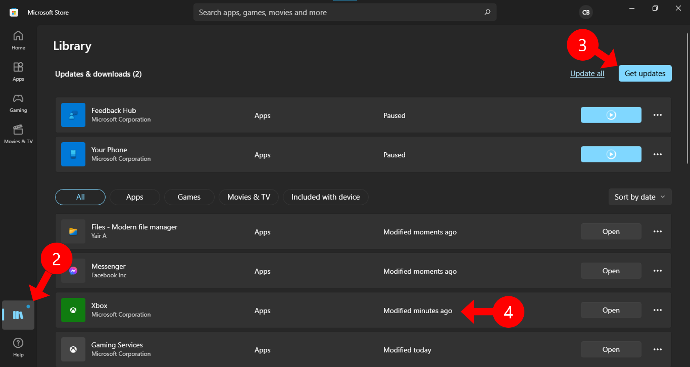

### Here's a way to install custom icon on Dead by Daylight in Xbox Game pass for PC
(Last update February 2022)

## Prerequisite
 - Microsoft Store (with Game pass account)
 - [Xbox](https://www.microsoft.com/store/productId/9MV0B5HZVK9Z) (not the console companion one)
 - [Xbox Insider Hub](https://www.microsoft.com/store/productId/9PLDPG46G47Z) 
 - Dead by Daylight Icon Toolbox

## Instruction

### Join Xbox Insider
 1. Launch Xbox Insider Hub

 2. Go to "Previews" tab

 3. Select "Windows Gaming"

 4. Click "Join" and wait for a few minutes

 5. If you check back on Xbox Insider Hub and "Windows Gaming" is now on "Joined" section, that mean you are now ready.

 6. Go to Microsoft Store

 7. Select "Library"

 8. Click "Get updates"

 9. Update Xbox app and make sure it's up to date.

 10. Launch Xbox app

 11. Click on your Xbox profile picture on top right near the Minimize button

 12. Then select "Settings"

 13. Go to "General" tab

 14. Turn the setting "Use advanced installation and management features" on
 
 15. A directory selection will appear which allow you to set which folder xbox games will installed on. By default it will set to `[Drive selected]:\XboxGames\` for example, on screenshot. Drive D is selected it will be on `D:\XboxGames\`

### Reinstall/Locate game path for toolbox

 16. If you have Dead by Daylight installed before, you need to uninstall existing one and reinstall on your selected folder

 17. After the game finished install, hover over the game on side bar, then click on a "..." button
 
 18. Select "Manage" on menu flyout

 19. Click on "FILES" header

 20. Click "BROWSE..." button

 21. Windows Explorer will pop up on xbox game directory (that has been set on step 15)

 22. Browse into "Dead by Daylight" then "Content"
 
 23. Copy current location onto clipboard

### Set install location

 24. Launch the Dead by Daylight Icon Toolbox

 25. Click on "Settings" button locate at bottom left of program

 26. Click above blank blue line next to "Dead by Daylight Install Path"
 
 27. Paste the game install path from step 23
 
 28. Click "Save"

congratulations, you can now install icon pack!

